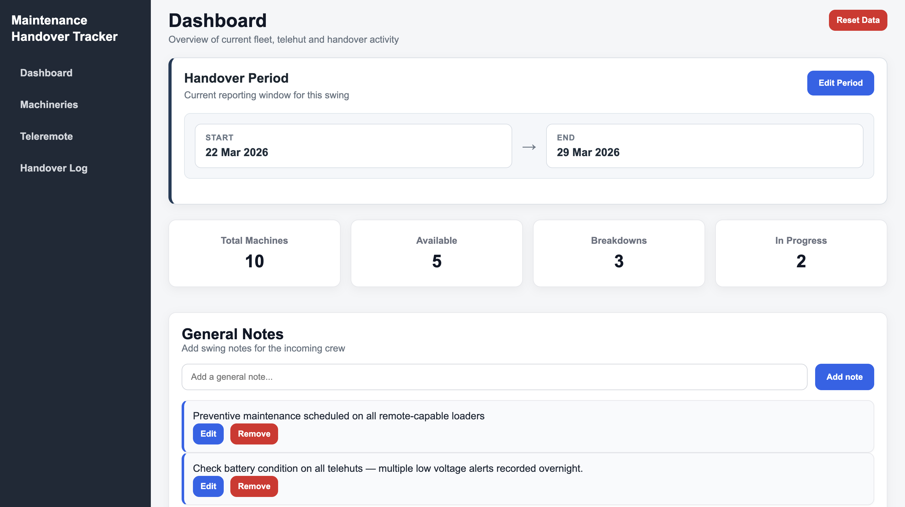
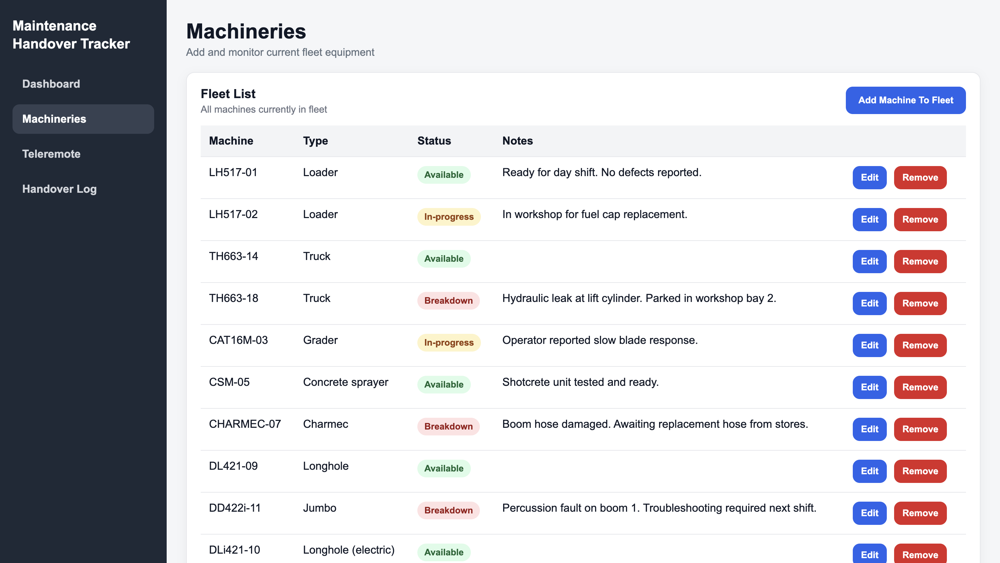
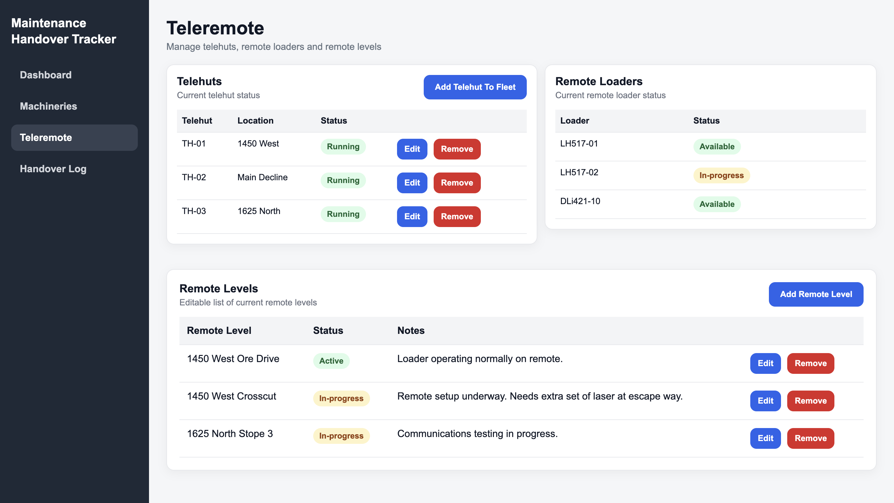
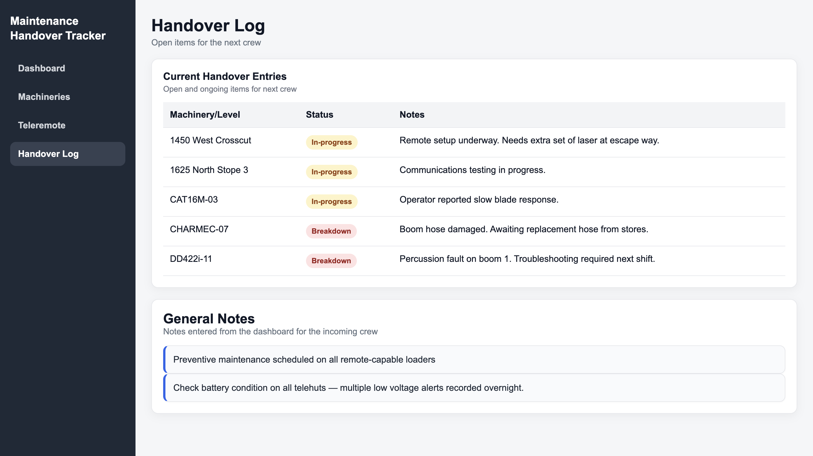
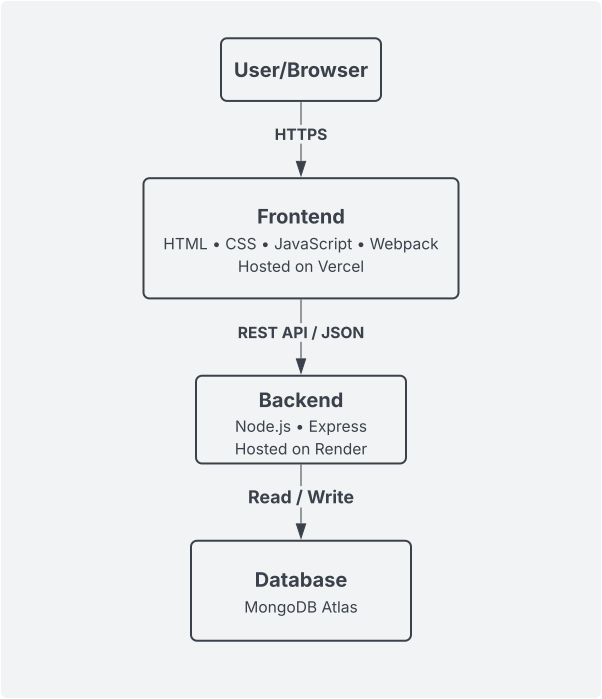

# Maintenance Handover Tracker

<br>

A full-stack web application designed around real-world mining maintenance and shift-handover workflows.

The application allows crews to track machinery status, telehuts, remote levels and outstanding issues, then automatically generates a structured handover log for the incoming shift.

<br>

## Live Demo

- **Frontend:** https://maintenance-handover-dashboard.vercel.app/
- **Backend:** https://maintenance-handover-dashboard.onrender.com/

<br>

## Overview

Maintenance Handover Tracker was developed to make shift handovers easier and more organised.
Instead of writing handover notes in a text editor, users can manage equipment status and important information from one central dashboard.
The application uses a separate frontend and backend connected through a REST API, with MongoDB Atlas used for data storage.

<br>

## Application Preview

<br>

### Dashboard

<br>

<p align="center">
  
  <br>
  <em>Provides an overview of equipment status and outstanding maintenance information.</em>
</p>

<br>

### Equipment & Operations

<br>

<p align="center">
  
  
	<br>
	   <em>Manage machinery, telehuts and remote operating areas from dedicated views.</em>
</p>

<br>

### Handover Log

<p align="center">
  
	   <br>
		<em>Automatically generates a structured handover from equipment and operational items requiring attention.</em>
</p>

## Features

- Dashboard displaying operational and equipment statistics
- Full CRUD functionality for machinery, telehuts, remote levels and general notes
- Equipment and operational status tracking
- Automatic handover log generation
- Editable handover period
- Remote-capable machinery view

<br>

## Tech Stack

**Frontend**

- JavaScript (ES Modules)
- HTML5 / CSS3
- Webpack

**Backend**

- Node.js
- Express

**Database**

- MongoDB Atlas

**Deployment**

- Vercel (Frontend)
- Render (Backend)

<br>

## System Architecture

The application uses a separate frontend and backend connected through a **REST API**. The frontend follows a modular structure using **controllers, services, and models** to separate UI logic, API communication, and application data.

<br>

<p align="center">
  
</p>

<br>

## API Endpoints

| Method | Endpoint                                           |
| ------ | -------------------------------------------------- |
| GET    | /machinery, /telehut, /remote-level, /general-note |
| POST   | /machinery, /telehut, /remote-level, /general-note |
| PUT    | /:resource/:id                                     |
| DELETE | /:resource/:id                                     |

<br>

## Data Mode

The frontend supports two persistence modes:

- `MUTATION_MODE=local` → uses `localStorage` for local development, testing, and seed data resets
- `MUTATION_MODE=api` → uses the backend API with MongoDB for persistent storage

This setup makes it easy to develop quickly without depending on the backend, while still supporting the full production stack.

<br>

## Run Locally

### 1. Clone the Repository

```bash
git clone https://github.com/buildwithseb/maintenance-handover-dashboard.git
cd maintenance-handover-dashboard
```

<br>

### 2. Set Up the Backend

```bash
cd backend
npm install
cp .env.example .env
```

Configure the `.env` file:

```env
MONGODB_URI=your_mongodb_connection_string
DB_NAME=your_database_name
PORT=3000
FRONTEND_URL=http://localhost:8081
```

> This project uses MongoDB Atlas. You will need a MongoDB Atlas cluster, database user, and connection string.

Start the backend:

```bash
npm start
```

The API will run at `http://localhost:3000`

<br>

### 3. Set Up the Frontend

Open a new terminal from the project root:

```bash
cd frontend
npm install
cp .env.example .env
```

Configure the frontend `.env` file:

```env
API_BASE_URL=http://localhost:3000
```

Start the frontend:

```bash
npm run dev
```

The application will run at `http://localhost:8081`.

<br>

## Technical Highlights

Through this project I have:

- Designed a separate frontend/backend architecture
- Built and consumed REST API endpoints
- Implemented CRUD operations across multiple application resources
- Worked with asynchronous frontend/API communication
- Structured JavaScript using controllers, services and models
- Integrated MongoDB Atlas with a Node.js/Express backend
- Configured environment variables for development and production
- Configured CORS between separately deployed applications
- Deployed frontend and backend services independently
- Used Git and GitHub for source control

<br>

## Future Improvements

- Authentication & user accounts _(currently in development)_
- Search and filtering
- Better UI validation and error handling
- Mobile responsiveness
- Export handover reports (PDF / CSV)
- Automated frontend and API testing
- React and TypeScript frontend migration

<br>

## Author

Sebastien Champeau
https://github.com/buildwithseb
